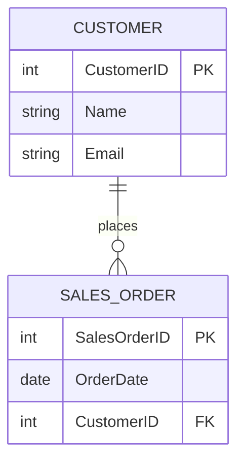

# ERD Generator

> **Interactive Database Design Tool** - Transform Mermaid.js ERD syntax into live interactive diagrams and generate DDL scripts for multiple database systems.


## ✨ Features

### 🎨 **Interactive Visual Editor**
- **Drag & Drop Interface**: Move tables around the canvas with intuitive interactions
- **Live Diagram Updates**: Real-time synchronization between code and visual representation
- **Zoom & Pan Controls**: Navigate large diagrams with ease
- **Relationship Visualization**: Animated connection lines showing table relationships

### 📝 **Mermaid.js Integration**
- **Full Syntax Support**: Complete Mermaid ERD syntax parsing
- **Real-time Parsing**: Instant diagram updates as you type
- **Error Handling**: Clear feedback for syntax errors
- **Bidirectional Sync**: Edit code or diagram, both stay in sync

### 🗄️ **Multi-Database DDL Export**
- **MySQL** - Complete DDL with constraints and indexes
- **PostgreSQL** - Advanced features and data types
- **SQLite** - Lightweight database schemas
- **SQL Server** - Enterprise database support
- **Oracle** - Full Oracle SQL compatibility

### 🚀 **Modern Developer Experience**
- **Sidebar Layout**: Efficient workflow with collapsible panels
- **Copy & Download**: One-click DDL script export
- **Responsive Design**: Works on desktop and tablet devices
- **Type Safety**: Full TypeScript implementation

## 🛠️ Technology Stack

- **Framework**: [Next.js 15](https://nextjs.org/) with App Router and Turbopack
- **UI Library**: [React 19](https://react.dev/) with React Flow for diagrams
- **Styling**: [Tailwind CSS](https://tailwindcss.com/) with [Lucide Icons](https://lucide.dev/)
- **Language**: [TypeScript](https://www.typescriptlang.org/) for type safety
- **Diagram Engine**: [@xyflow/react](https://reactflow.dev/) for interactive canvas
- **Parsing**: Custom Mermaid.js ERD parser

## 🚀 Quick Start

### Prerequisites
- Node.js 18+ 
- npm or yarn package manager

### Installation

1. **Clone the repository**
   ```bash
   git clone https://github.com/code13night/erd.git
   cd erd
   ```

2. **Install dependencies**
   ```bash
   npm install
   ```

3. **Start development server**
   ```bash
   npm run dev
   ```

4. **Open your browser**
   Navigate to [http://localhost:3000](http://localhost:3000)

### Build for Production
```bash
npm run build
npm start
```

## 📖 Usage

### 1. **Visual Editing**
- Click tables to edit properties
- Drag tables to reposition them
- Use zoom controls to navigate large diagrams

### 2. **Code Editing**
- Use the left sidebar to edit Mermaid ERD syntax
- Changes automatically update the visual diagram
- Syntax errors are highlighted with helpful messages

### 3. **DDL Generation**
- Open the right sidebar to view generated DDL
- Select your target database from the dropdown
- Copy to clipboard or download as `.sql` file

## 📁 Project Structure

```
src/
├── app/                    # Next.js App Router
│   ├── globals.css        # Global styles
│   ├── layout.tsx         # Root layout
│   └── page.tsx           # Main application page
├── components/
│   ├── diagram/           # Interactive diagram components
│   │   ├── erd-canvas.tsx # Main React Flow canvas
│   │   └── table-node.tsx # Table node component
│   └── editors/           # Code and DDL editors
│       ├── mermaid-editor.tsx  # Mermaid code editor
│       └── ddl-viewer.tsx      # DDL script viewer
├── lib/                   # Core utilities and parsers
│   ├── mermaid-parser.ts  # Mermaid ERD syntax parser
│   ├── ddl-generator.ts   # Multi-database DDL generator
│   └── utils.ts           # Common utility functions
└── types/
    └── erd.ts             # TypeScript type definitions
```

## 🎯 Example Usage

### Mermaid ERD Syntax


### Generated DDL (MySQL)
```sql
CREATE TABLE CUSTOMER (
    CustomerID INT PRIMARY KEY,
    Name VARCHAR(255) NOT NULL,
    Email VARCHAR(255) NOT NULL
);

CREATE TABLE SALES_ORDER (
    SalesOrderID INT PRIMARY KEY,
    OrderDate DATE NOT NULL,
    CustomerID INT NOT NULL,
    FOREIGN KEY (CustomerID) REFERENCES CUSTOMER(CustomerID)
);
```

## 📋 Supported Database Features

| Feature | MySQL | PostgreSQL | SQLite | SQL Server | Oracle |
|---------|-------|------------|--------|------------|--------|
| Primary Keys | ✅ | ✅ | ✅ | ✅ | ✅ |
| Foreign Keys | ✅ | ✅ | ✅ | ✅ | ✅ |
| NOT NULL | ✅ | ✅ | ✅ | ✅ | ✅ |
| UNIQUE | ✅ | ✅ | ✅ | ✅ | ✅ |
| Data Types | ✅ | ✅ | ✅ | ✅ | ✅ |
| Auto Increment | ✅ | ✅ | ✅ | ✅ | ✅ |

## 🤝 Contributing

We welcome contributions! Please see our [Contributing Guidelines](CONTRIBUTING.md) for details.

### Development Setup
1. Fork the repository
2. Create a feature branch: `git checkout -b feature/amazing-feature`
3. Make your changes and test them
4. Commit your changes: `git commit -m 'Add amazing feature'`
5. Push to the branch: `git push origin feature/amazing-feature`
6. Open a Pull Request

## 📄 License

This project is licensed under the MIT License - see the [LICENSE](LICENSE) file for details.

## 🙏 Acknowledgments

- [Mermaid.js](https://mermaid.js.org/) for the ERD syntax inspiration
- [React Flow](https://reactflow.dev/) for the excellent diagramming library
- [Next.js](https://nextjs.org/) team for the amazing framework
- [Tailwind CSS](https://tailwindcss.com/) for the utility-first CSS framework

## 📚 Related Resources

- [Mermaid ERD Syntax Documentation](https://mermaid.js.org/syntax/entityRelationshipDiagram.html)
- [Database Design Best Practices](https://en.wikipedia.org/wiki/Database_design)
- [SQL DDL Reference](https://www.w3schools.com/sql/sql_ddl.asp)

## 🐛 Issues & Feedback

Found a bug or have a feature request? Please [open an issue](https://github.com/code13night/erd/issues) on GitHub.

---
